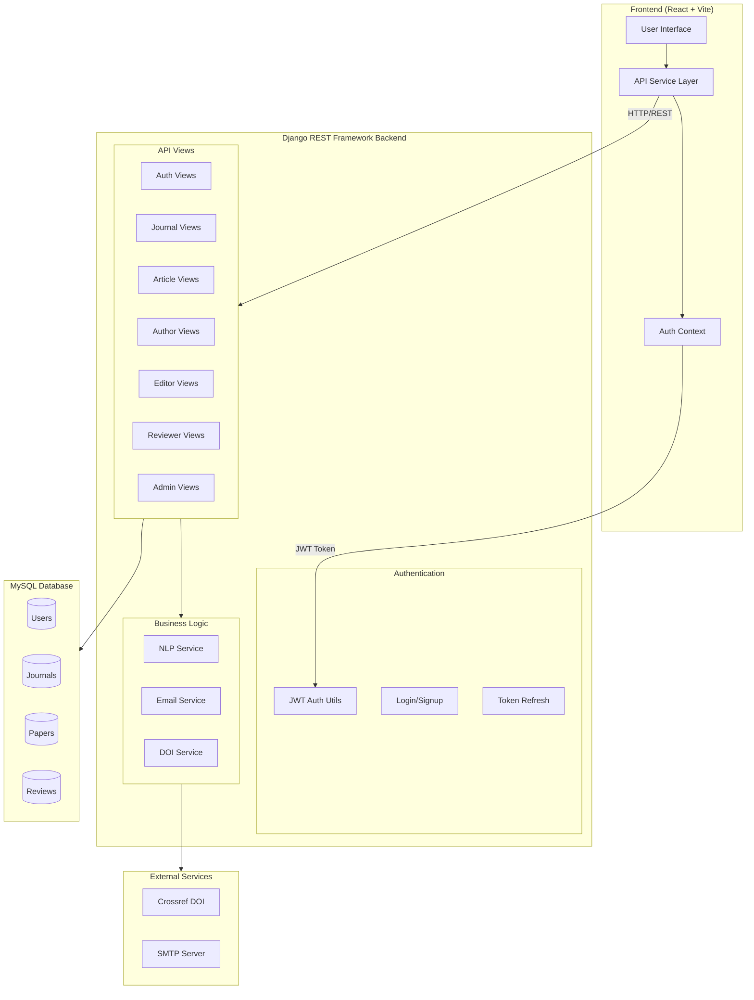
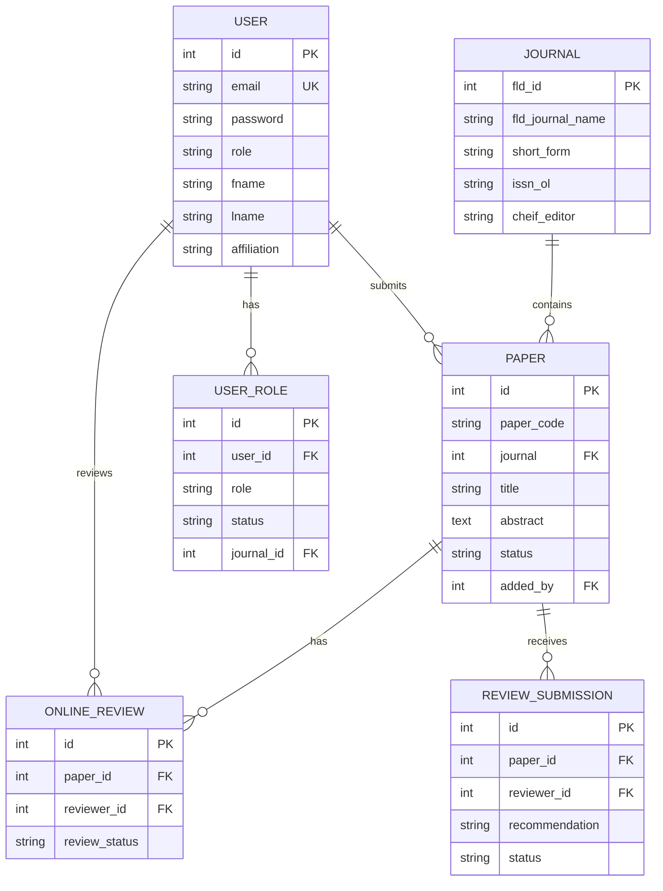
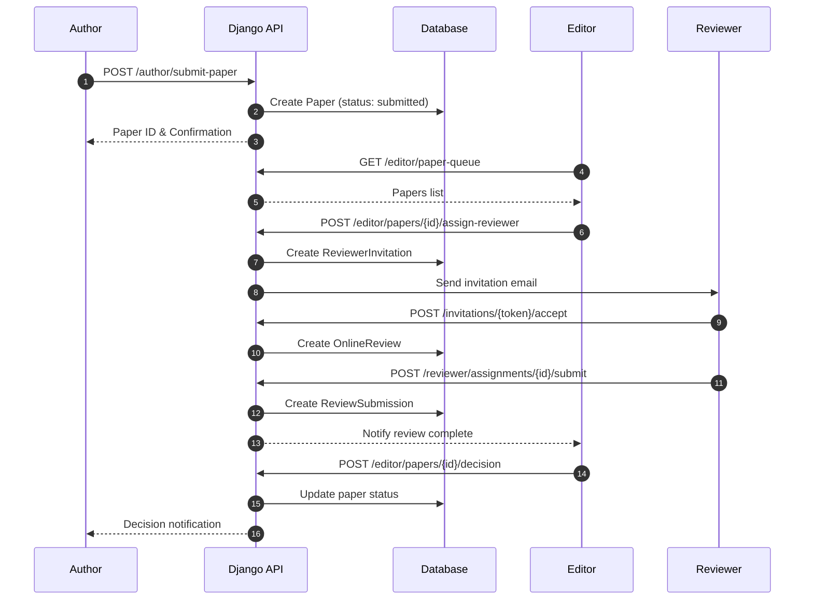
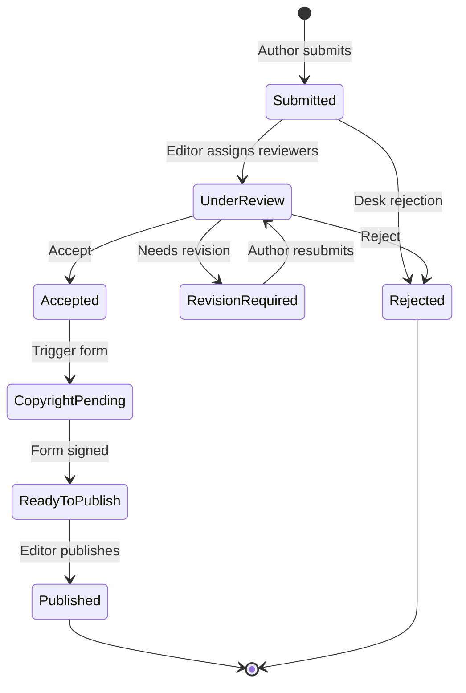
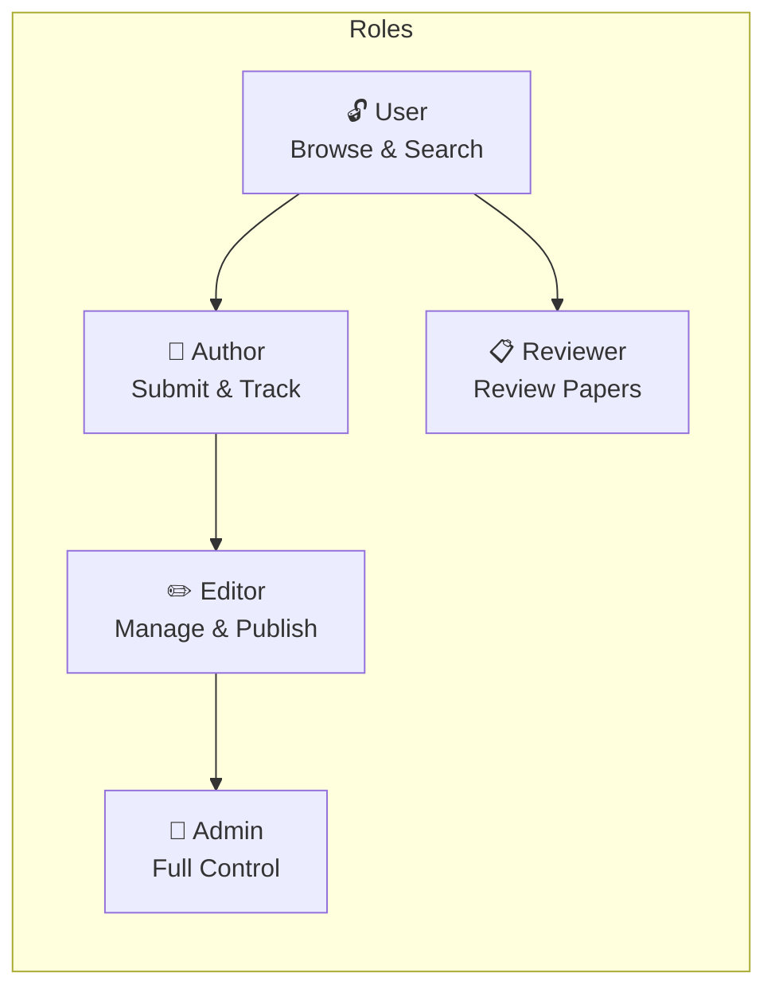
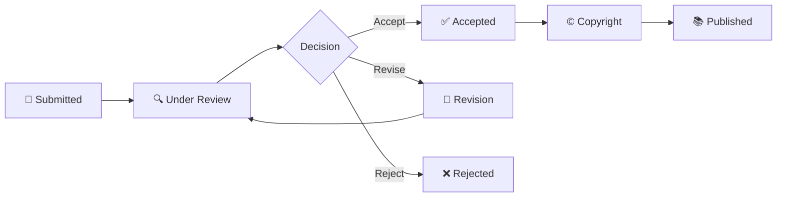

# BreakThrough Journal Management System

<p align="center">
  <strong>A comprehensive academic journal management platform</strong>
</p>

<p align="center">
  <a href="#features">Features</a> •
  <a href="#architecture">Architecture</a> •
  <a href="#quick-start">Quick Start</a> •
  <a href="#api">API</a> •
  <a href="#documentation">Documentation</a>
</p>

---

## Overview

BreakThrough is a full-featured academic journal management system that handles the complete scholarly publishing workflow — from paper submission through peer review to publication with DOI registration.

## Features

### For Authors
- 📝 Submit manuscripts with co-author management
- 📊 Track submission status in real-time
- 📬 Receive review feedback and decisions
- 🔄 Submit revisions with tracked changes
- ✍️ Digital copyright form signing

### For Reviewers
- 📩 Receive and manage review invitations
- 📄 Access blinded manuscripts
- ⭐ Submit structured reviews with ratings
- 📎 Upload detailed review reports
- 📜 View personal review history

### For Editors
- 📋 Manage paper queue by journal
- 👥 Assign reviewers (internal & external)
- 🔍 NLP-powered reviewer recommendations
- ✅ Make editorial decisions
- 📚 Publish to volume/issue with DOI

### For Administrators
- 👤 User and role management
- 📰 Journal configuration
- 📧 Email template customization
- 📈 Analytics and reporting
- 🔐 Access control management

## Architecture

### System Overview



### Database Schema



### Paper Submission Workflow



### Paper Status State Machine



### Technology Stack

| Component | Technology |
|-----------|------------|
| Frontend | React 18, Vite, TailwindCSS |
| Backend | Django 4.2, Django REST Framework |
| Database | MySQL 8.0 |
| Auth | JWT (PyJWT) |
| DOI | Crossref API |


## Quick Start

### Prerequisites

- Python 3.10+
- Node.js 18+
- MySQL 8.0+

### Backend Setup

```bash
cd backend
python -m venv venv
source venv/bin/activate  # Windows: venv\Scripts\activate
pip install -r requirements.txt

# Configure environment
cp .env.example .env
# Edit .env with your database credentials

# Run migrations
python manage.py migrate

# Start server
python manage.py runserver
```

### Frontend Setup

```bash
cd frontend
npm install
npm run dev
```

The application will be available at:
- Frontend: http://localhost:5173
- Backend API: http://localhost:8000/api/v1/

## API

### Endpoints Overview

| Module | Count | Base Path |
|--------|-------|-----------|
| Authentication | 5 | `/api/v1/auth/` |
| Journals | 12 | `/api/v1/journals/` |
| Articles | 8 | `/api/v1/articles/` |
| Author | 22 | `/api/v1/author/` |
| Editor | 24 | `/api/v1/editor/` |
| Reviewer | 20 | `/api/v1/reviewer/` |
| Roles | 8 | `/api/v1/roles/` |
| Copyright | 3 | `/api/v1/copyright/` |
| Admin | 41 | `/api/v1/admin/` |

**Total: 130 API endpoints**

### Authentication

```bash
# Login
curl -X POST http://localhost:8000/api/v1/auth/login \
  -H "Content-Type: application/json" \
  -d '{"email": "user@example.com", "password": "password"}'

# Use token for protected endpoints
curl http://localhost:8000/api/v1/author/dashboard/stats \
  -H "Authorization: Bearer <access_token>"
```

## Documentation

- [Architecture & Diagrams](backend/docs/ARCHITECTURE.md)
- [API Gap Analysis](backend/docs/api_gap_analysis.txt)

## Project Structure

```
BreakThrough/
├── backend/                 # Django REST Framework API
│   ├── api/                 # Main application
│   │   ├── views_*.py       # API views by module
│   │   ├── models.py        # Database models
│   │   ├── serializers.py   # DRF serializers
│   │   └── urls.py          # URL routing
│   ├── bp_backend/          # Django settings
│   ├── docs/                # Documentation
│   └── requirements.txt     # Python dependencies
│
└── frontend/                # React + Vite SPA
    ├── src/
    │   ├── api/             # API service layer
    │   ├── components/      # UI components
    │   ├── pages/           # Page components
    │   └── contexts/        # React contexts
    └── package.json         # Node dependencies
```

## User Roles



| Role | Description |
|------|-------------|
| **User** | Basic access, can browse journals and articles |
| **Author** | Can submit papers and track submissions |
| **Reviewer** | Can review assigned papers |
| **Editor** | Can manage papers for assigned journals |
| **Admin** | Full system access |

## Paper Workflow



## Environment Variables

```env
# Database
DB_NAME=breakthroughdb
DB_USER=your_user
DB_PASSWORD=your_password
DB_HOST=localhost
DB_PORT=3306

# JWT
JWT_SECRET_KEY=your-secret-key

# Email (optional)
EMAIL_HOST=smtp.example.com
EMAIL_USER=noreply@example.com
EMAIL_PASSWORD=your-password
```

## Contributing

1. Fork the repository
2. Create a feature branch (`git checkout -b feature/amazing-feature`)
3. Commit your changes (`git commit -m 'Add amazing feature'`)
4. Push to the branch (`git push origin feature/amazing-feature`)
5. Open a Pull Request

## License

This project is proprietary software. All rights reserved.

---

<p align="center">
  Built with ❤️ for academic publishing
</p>
