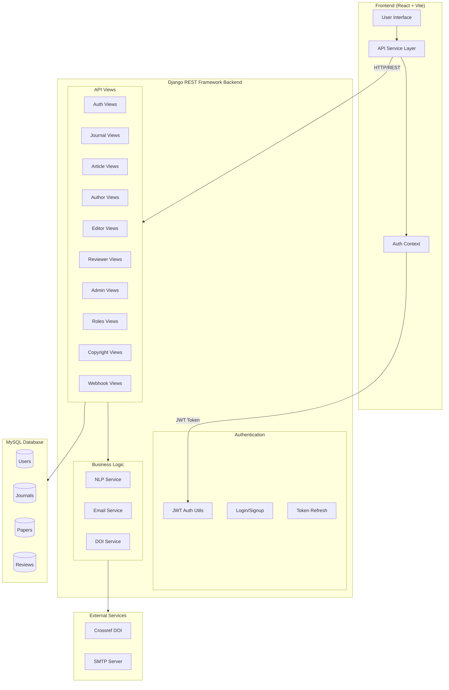
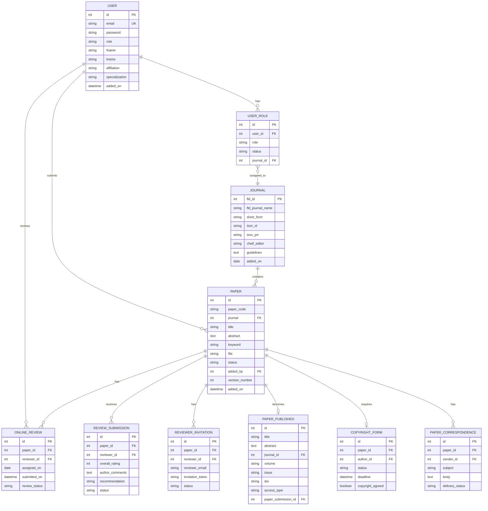
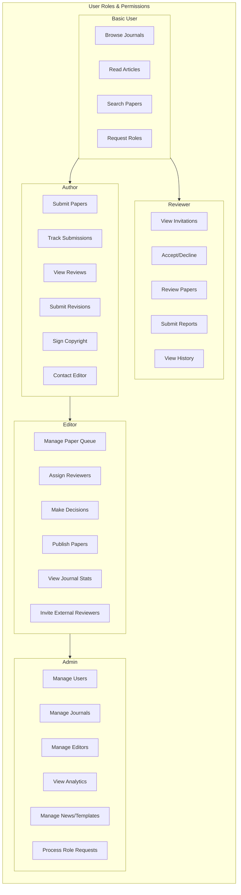
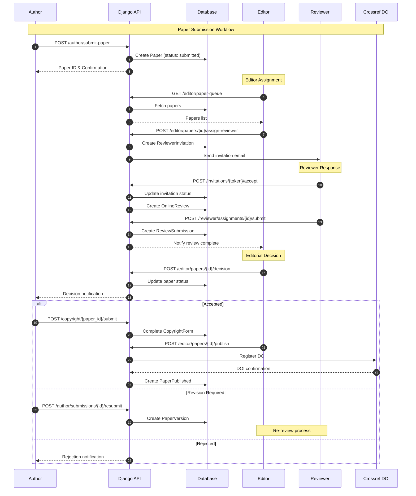
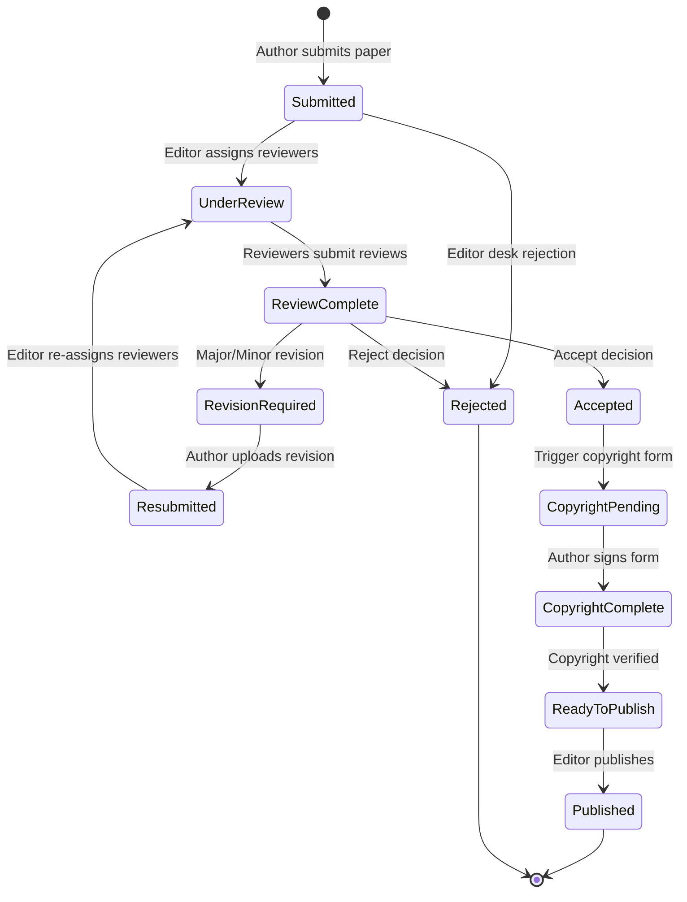
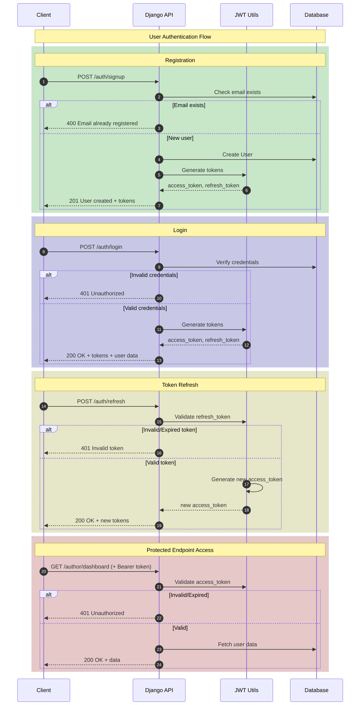

# BreakThrough Journal Management System

## Technical Documentation

**Version:** 1.0.0  
**Last Updated:** March 29, 2026  
**Status:** Production Ready

---

## Table of Contents

1. [System Overview](#system-overview)
2. [Architecture](#architecture)
3. [Database Schema](#database-schema)
4. [API Reference](#api-reference)
5. [User Roles & Permissions](#user-roles--permissions)
6. [Paper Workflow](#paper-workflow)
7. [Authentication](#authentication)
8. [Deployment](#deployment)

---

## System Overview

BreakThrough is a comprehensive academic journal management system that facilitates the entire scholarly publishing workflow from paper submission to publication. The system supports multiple journals, peer review processes, DOI registration, and role-based access control.

### Key Features

- **Multi-Journal Support**: Manage multiple academic journals from a single platform
- **Peer Review Management**: Complete reviewer invitation, assignment, and review tracking
- **Role-Based Access Control**: Author, Reviewer, Editor, and Admin roles with granular permissions
- **DOI Integration**: Automatic DOI registration via Crossref
- **Email Notifications**: Automated correspondence tracking and email templates
- **Analytics Dashboard**: Comprehensive statistics for administrators and editors
- **NLP-Powered Features**: Journal recommendations and reviewer matching

### Technology Stack

| Component | Technology |
|-----------|------------|
| **Backend** | Django 4.2 + Django REST Framework |
| **Frontend** | React 18 + Vite |
| **Database** | MySQL 8.0 |
| **Authentication** | JWT (PyJWT) |
| **API Documentation** | OpenAPI 3.0 |
| **Deployment** | cPanel / Passenger WSGI |

---

## Architecture

### System Architecture Diagram



### Backend Structure

```
backend/
├── api/                      # Main API application
│   ├── views_auth.py         # Authentication endpoints
│   ├── views_admin.py        # Admin dashboard & management
│   ├── views_articles.py     # Public article access
│   ├── views_author.py       # Author submission management
│   ├── views_editor.py       # Editorial workflow
│   ├── views_journals.py     # Journal CRUD operations
│   ├── views_reviewer.py     # Reviewer assignment & review
│   ├── views_roles.py        # Role management
│   ├── views_webhooks.py     # Email delivery webhooks
│   ├── models.py             # Database models
│   ├── serializers.py        # DRF serializers
│   ├── urls.py               # URL routing
│   ├── auth_utils.py         # Authentication utilities
│   └── jwt_utils.py          # JWT token handling
├── bp_backend/               # Django project settings
│   ├── settings.py           # Configuration
│   ├── urls.py               # Root URL config
│   └── wsgi.py               # WSGI application
├── media/                    # Uploaded files storage
├── docs/                     # Documentation
└── manage.py                 # Django management script
```

### Frontend Structure

```
frontend/
├── src/
│   ├── api/                  # API service layer
│   │   ├── apiService.js     # Main API client
│   │   └── axios.js          # Axios configuration
│   ├── components/           # Reusable UI components
│   │   ├── auth/             # Authentication forms
│   │   ├── header/           # Navigation header
│   │   ├── sidebar/          # Navigation sidebar
│   │   └── ...               # Other components
│   ├── pages/                # Page components
│   ├── contexts/             # React contexts
│   ├── hooks/                # Custom hooks
│   └── utils/                # Utility functions
├── public/                   # Static assets
└── package.json              # Dependencies
```

---

## Database Schema

### Entity Relationship Diagram



### Core Tables

| Table | Purpose |
|-------|---------|
| `user` | User accounts and profiles |
| `journal` | Journal metadata and settings |
| `paper` | Submitted manuscripts |
| `paper_published` | Published articles with DOI |
| `online_review` | Review assignments |
| `review_submission` | Completed reviews |
| `reviewer_invitation` | External reviewer invitations |
| `user_role` | Role assignments per user |
| `role_request` | Pending role requests |
| `paper_correspondence` | Email communication tracking |
| `email_template` | Configurable email templates |
| `copyright_form` | Copyright transfer agreements |

---

## API Reference

### Endpoint Summary

| Module | Endpoints | Description |
|--------|-----------|-------------|
| **Authentication** | 5 | Login, signup, token refresh, profile |
| **Journals** | 12 | CRUD, volumes, issues, recommendations |
| **Articles** | 8 | Public article access, search, news |
| **Author** | 22 | Submissions, reviews, revisions |
| **Editor** | 24 | Paper queue, decisions, publishing |
| **Reviewer** | 20 | Invitations, assignments, reviews |
| **Roles** | 8 | Role management, requests |
| **Copyright** | 3 | Copyright form workflow |
| **Webhooks** | 2 | Email delivery tracking |
| **Admin** | 41 | Full system administration |

**Total: 130 endpoints**

### Authentication Endpoints

| Method | Endpoint | Description |
|--------|----------|-------------|
| POST | `/api/v1/auth/login` | User login |
| POST | `/api/v1/auth/signup` | User registration |
| POST | `/api/v1/auth/refresh` | Refresh JWT token |
| GET | `/api/v1/auth/me` | Get current user |
| POST | `/api/v1/auth/change-password` | Change password |

### Author Endpoints

| Method | Endpoint | Description |
|--------|----------|-------------|
| GET | `/api/v1/author/dashboard/stats` | Dashboard statistics |
| POST | `/api/v1/author/submit-paper` | Submit new paper |
| GET | `/api/v1/author/submissions` | List submissions |
| GET | `/api/v1/author/submissions/{id}` | Submission details |
| POST | `/api/v1/author/submissions/{id}/resubmit` | Submit revision |
| GET | `/api/v1/author/submissions/{id}/reviews` | View reviews |
| GET | `/api/v1/author/submissions/{id}/decision` | View decision |

### Editor Endpoints

| Method | Endpoint | Description |
|--------|----------|-------------|
| GET | `/api/v1/editor/paper-queue` | Papers awaiting action |
| POST | `/api/v1/editor/papers/{id}/assign-reviewer` | Assign reviewer |
| POST | `/api/v1/editor/papers/{id}/invite-reviewer` | Invite external |
| POST | `/api/v1/editor/papers/{id}/decision` | Make decision |
| POST | `/api/v1/editor/papers/{id}/publish` | Publish paper |
| GET | `/api/v1/editor/reviewers` | Available reviewers |

### Admin Endpoints

| Method | Endpoint | Description |
|--------|----------|-------------|
| GET | `/api/v1/admin/dashboard/stats` | System statistics |
| GET | `/api/v1/admin/users` | List all users |
| POST | `/api/v1/admin/users/create` | Create user |
| GET | `/api/v1/admin/papers` | List all papers |
| GET | `/api/v1/admin/editors` | Manage editors |
| GET | `/api/v1/admin/analytics/*` | Analytics endpoints |

---

## User Roles & Permissions

### Role Hierarchy



### Permission Matrix

| Feature | User | Author | Reviewer | Editor | Admin |
|---------|------|--------|----------|--------|-------|
| View public articles | ✓ | ✓ | ✓ | ✓ | ✓ |
| Submit papers | - | ✓ | ✓ | ✓ | ✓ |
| View own submissions | - | ✓ | - | - | ✓ |
| Review assigned papers | - | - | ✓ | - | - |
| Assign reviewers | - | - | - | ✓ | ✓ |
| Make editorial decisions | - | - | - | ✓ | ✓ |
| Publish papers | - | - | - | ✓ | ✓ |
| Manage users | - | - | - | - | ✓ |
| System configuration | - | - | - | - | ✓ |

---

## Paper Workflow

### Submission & Review Process



### Paper Status State Machine



### Status Definitions

| Status | Description |
|--------|-------------|
| `submitted` | Initial submission received |
| `under_review` | Assigned to reviewer(s) |
| `revision_required` | Author must revise |
| `resubmitted` | Revised version submitted |
| `accepted` | Accepted for publication |
| `copyright_pending` | Awaiting copyright form |
| `ready_to_publish` | Copyright complete |
| `published` | Live on platform |
| `rejected` | Not accepted |

---

## Authentication

### JWT Authentication Flow



### Token Configuration

| Setting | Value |
|---------|-------|
| Access Token Expiry | 15 minutes |
| Refresh Token Expiry | 7 days |
| Algorithm | HS256 |
| Token Type | Bearer |

### Request Headers

```http
Authorization: Bearer <access_token>
Content-Type: application/json
```

---

## Deployment

### Requirements

```txt
Django>=4.2
djangorestframework>=3.14
PyJWT>=2.8
mysqlclient>=2.2
python-dotenv>=1.0
scikit-learn>=1.3
numpy>=1.24
```

### Environment Variables

```bash
# Database
DB_NAME=breakthroughdb
DB_USER=your_user
DB_PASSWORD=your_password
DB_HOST=localhost
DB_PORT=3306

# JWT
JWT_SECRET_KEY=your-secret-key
JWT_ALGORITHM=HS256

# Email
EMAIL_HOST=smtp.example.com
EMAIL_PORT=587
EMAIL_USER=noreply@example.com
EMAIL_PASSWORD=your-email-password

# Crossref DOI
CROSSREF_USERNAME=your_username
CROSSREF_PASSWORD=your_password
CROSSREF_DOI_PREFIX=10.xxxxx
```

### Running Locally

```bash
# Backend
cd backend
python -m venv venv
source venv/bin/activate
pip install -r requirements.txt
python manage.py migrate
python manage.py runserver

# Frontend
cd frontend
npm install
npm run dev
```

### Production Deployment (cPanel)

1. Upload files to `public_html/backend`
2. Configure `passenger_wsgi.py`
3. Set up Python application in cPanel
4. Configure environment variables
5. Run migrations via SSH

---

## API Response Formats

### Success Response

```json
{
  "success": true,
  "data": { ... },
  "message": "Operation successful"
}
```

### Error Response

```json
{
  "success": false,
  "error": {
    "code": "VALIDATION_ERROR",
    "message": "Invalid input",
    "details": { ... }
  }
}
```

### Pagination

```json
{
  "success": true,
  "data": [ ... ],
  "pagination": {
    "total": 100,
    "page": 1,
    "per_page": 20,
    "total_pages": 5
  }
}
```

---

## Support & Maintenance

### Logs

- Application logs: `backend/logs/`
- Django logs: `manage.py runserver` output
- Error tracking: Custom exception handler

### Health Check

```bash
GET /api/v1/health
```

### Database Backup

```bash
mysqldump -u user -p breakthroughdb > backup.sql
```

---

*Documentation generated for BreakThrough Journal Management System v1.0.0*
